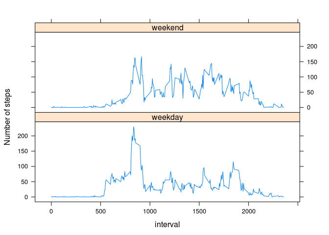

# Reproducible Research: Peer Assessment 1
<!---

-->

## Loading and preprocessing the data

```r
data <- read.csv("activity.csv")
```

## What is mean total number of steps taken per day?

```r
library(plyr)

dailyTotal <- ddply(data, .(date), function(x) {
    totalSteps <- sum(x$steps)
    data.frame(totalSteps = totalSteps)
  })
hist(dailyTotal$totalSteps, main="Total number of steps per day",xlab="Number of steps", breaks=9, ylim=c(0,20))
```

 

```r
summary(dailyTotal$totalSteps)
```

```
##    Min. 1st Qu.  Median    Mean 3rd Qu.    Max.    NA's 
##      41    8841   10760   10770   13290   21190       8
```

## What is the average daily activity pattern?

```r
dailyMean <- ddply(data, .(interval), function(x) {
    intervalMean <- mean(x$steps, na.rm=TRUE )
    data.frame(intervalMean = intervalMean)
  })

plot(dailyMean$intervalMean~dailyMean$interval, type="l", main="Average daily activity pattern", ylab="Average steps per 5 min interval", xlab="Interval")
```

 

## Imputing missing values

```r
print(sum(is.na(data$steps)))
```

```
## [1] 2304
```

```r
dataFill <- ddply(data, .(interval), function(x) {
    steps <- replace(x$steps, is.na(x$steps), mean(x$steps, na.rm=TRUE ))
    data.frame(date = x$date, steps = steps)
  })

dailyTotalFill <- ddply(dataFill, .(date), function(x) {
    totalSteps <- sum(x$steps)
    data.frame(totalSteps = totalSteps)
  })

hist(dailyTotalFill$totalSteps, main="Total number of steps per day, filled data",xlab="Number of steps", breaks=9, ylim=c(0,25))
```

 

```r
summary(dailyTotalFill$totalSteps)
```

```
##    Min. 1st Qu.  Median    Mean 3rd Qu.    Max. 
##      41    9819   10770   10770   12810   21190
```

## Are there differences in activity patterns between weekdays and weekends?

```r
dataFill$day <- factor(as.numeric(weekdays(as.Date(dataFill$date)) %in% c("Saturday","Sunday")))
levels(dataFill$day) <- c("weekday","weekend")

wkdyTotalFill <- ddply(dataFill, .(day, interval), function(x) {
    intervalMean <- mean(x$steps, na.rm=TRUE )
    data.frame(intervalMean = intervalMean)
  })

library(lattice)
xyplot(intervalMean ~ interval | day, data = wkdyTotalFill, 
       layout = c(1,2), 
       type="l",
       ylab="Number of steps")
```

 
